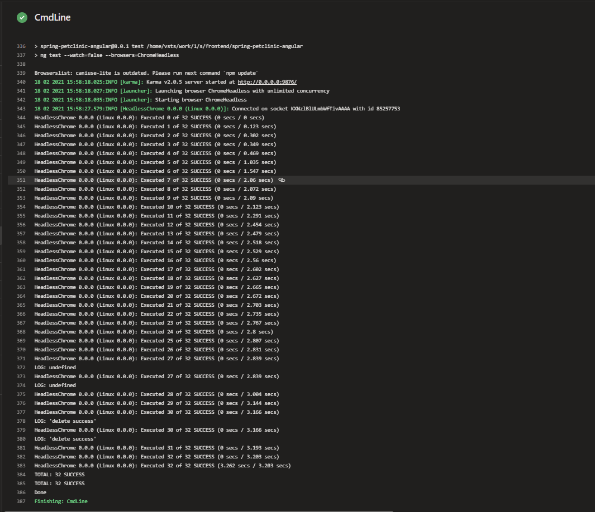

## Brief 

The brief for this project was to plan, design and implement a solution for automating the development of the Petclinic application, with the tools, methodologies and technologies that were covered during training. 

## Requirements 
To launch the application the following must be considered:

* What tools work best? for example: Ansible, Terraform, Kubernetes etc.

* How a developer can test and change their feratures, before deployment of the app.

* How changes on the GitHub repository automatically build and deploy to testing and live environment?

* Running costs? What are the monthly estimates?

<h2>Scope</h2>

* An project managing tracking system , with full expansion on tasks needed to complete the project.
* An application fully integrated using the feature branch model into a version control system which will be built through a CI server and deployed to a cloud-based virtual machine
* If a change is made to a code base, then Webhooks should be used so that the CI server recreates and redeploys the changed application.
* The application must be deployed using containerisation and an orchestration tool.
* The application must be deployed using containerisation and an orchestration tool.

<h2> Platform used </h2>

* Project tracking: Azure Devops boards
* Version: Git repo hosted on Azure Devops
* CI server: Azure Devops CI pipeline
* Configuration management: Ansible, Terraform 
* Cloud server: Azure
* Containerisation: Docker
* Orchestration tool: Kubernetes
* Reverse Proxy: NGINX

<h1> Tools </h1>

## Terraform
Our choosen tool for infrastructure orchestration was Terraform, as it is well documented and uses yaml. This allows for easy configuration and management.
We can specify what we want like a shopping cart, and Terraform handles the logistics. 
We used Terraform to provision an AKS cluster as well as the manager VM with their respective resource groups.
## Ansible
We chose Ansible because a single playbook can install each dependency on all the virtual machines we used. Ansible also ensures that everything is in the desired state.
Ansible is a powerful configuration management tool for our development environment. It was used to prevent environmental drift and install the various dependencies on the development environments. 
Instead of having to go into each individual Virtual machine and setting up the build environment, such as installing docker or initializing the swarm and adding each node, Ansible playbooks could be used instead, which help incorporate infrastructure automation and reduce human error.
Ansible works by excuting the commands in the playbook over SSH, so all that needs to be configured are SSH keys on all nodes.
## Docker Compose
The first main framework used is Docker-Compose. Docker compose is a tool used to define and run multiple containers at the same time, within the same network by running one command: docker-compose up. These containers are all generated by images created by individual dockerfiles which need to be placed in the directory of each service.
## Nginx
NginX was implemented as a reverse proxy. Users are able to visit one URL, and they are shown the application. But behind the scenes, NginX sends the user's request to the container with the least load, providing an addtional layer of security and anonymity.
## Kubernetes
Kubernetes was our container orchestration tool, it connects to a pre-made cluster and deploy the pods which contained the services required to run the application.
The reason we chose Kubernetes over Docker-swarm is that it's well integrated into Azure container registry, Kubernetes is also more flexible.
## Azure Devops
We selected Azure Devops because it has all the key fundamentals that are required for a DevOps project such as:
 * dedicated Kanban board
 * private git repo via Azure repos
 * Azure pipelines
 * Azure container registry
 * Azure test plans
 * easily set project permissions
<h1> Documentation </h1>

### Planning

The project used Dev Ops tools and techniques, and as such used a Kanban board, with Epics and Issues that were assigned to the various team members to track progress and maintain order for the project.
The chosen Kanban board tech for this project was Azure Dev Ops' Boards, this choice was made to ensure that everything related to the project was accessible in one place.
### CI/CD Pipeline

The image above represents our CI/CD pipeline, it is a breakdown of how each service and the tools we have chosen work together. The image illustrates what we feel is one of the most efficient ways to deploy the app.  

The image above gives a detailed overview on how the Azure pipeline functions for the build and deployment stage of the application. In short, once the pipeline is triggered it will create an AKS cluster
via terraform plugins (if it doesn't already exist).

Once the first task has finished it will test the application via a command line block and custom script, which ensures that the VM running the pipeline has
the various dependencies required to test the application, namely nodejs, npm and angular cli. Once the dependencies are installed the script will run npm test, which is configured to run a set of tests using node via
Karma testing.

Once the application files have been successfully tested and 32/32 tests pass, the pipeline uses docker-compose plugins to build and push the images to the Azure Container Registry, via a docker-compose yml file.
Additional code must be added within these blocks to allow the pipeline to use the Azure Container Registry, such as the subscription ID and container registry type. This concludes the build stage.

Once the application files have been tested and the images successfully built and pushed to the container registry the last few steps are to deploy the application to an AKS cluster, using manifests.
The manifests for each pod reference the container registry images, and are uploaded to the pipeline workspace for the deployments to reference. With a combination of secret tokens and Azure Integration we are able to pull images from the Azure Container Registry and use them to deploy
the front-end, back-end and nginx pods. The manifests and application codebases are designed in a way that allows the pods to communicate and reference each other, meaning that the user can navigate to the nginx ip, and interact with the front-end
Once a user has entered new details into the front-end, such as a new vet, they will be able to see their change implemented on the back-end (And in an SQL database in future).

This image above illustrates how we used a manager vm to configure a dev-environment. For the application to be safely deployed and environmental drift to be minimised it is reccomended to use a development environment.
The development environment we used relies on a terraform script to create a manager vm, which is used to run an ansible playbook on a number of other VMs that installs all project dependencies, meaning that all the developer has to do is set-up their credentials and clone down the repository. The other VM's were set up manually but can be setup with Terraform
in the future. Once the other VMs are created the developers must connect to them from within the manager vm, and using their specified username, i.e Brendan connects to AZP-MGR as AZP-MGR, Brendan then connects to AZP-DEV-Brendan as Brendan
from AZP-MGR. 
### Testing

The testing was executed by the pipeline which uses the angular CLI and Karma through npm to test the application before its built.
### Front End Design

### Pricing

The pricing was calculated using Azure calculator and takes into consideration the dev-environment and the cluster itself.

### Risk Assessment

# Issues
 * Azure Devops has potentially outdated documentation, which when combined with how new the platform is to the CI ecosystem can lead to issues which are difficult to troubleshoot.
 * Kubernetes is not connecting to the cluster initiated by Terraform automatically. This is due to a lack of knowledge both on Azure Pipelines and Kubernetes, in addition to how the two interact.

## Further imporvements
 * Set up a managed SQL database so that any information a user inputs into the front-end is persisted, even when the cluster is taken down.
 * Get Kubernetes to connect to the cluster built by Terraform automatically. This can likely be done with much more research on the platform.
 * Using Terraform to provision the dev-environment instead of manually setting it up. As with the above issue, this can easily be rectified in future with a greater understanding of how to provision inter-connected resources within Terraform.
# Authors

* Brendan Kirkby
* Gergely Komuves
* Opeoluwa Orekoya
* Kunal Singh
* Hitesh Patel

## Acknowledgements
Thank you very much for Harry Volker for the mentoring, project guidance and troubleshooting.
He has gone above beyond to help with this project and making sure that the fundamentals have been understood.